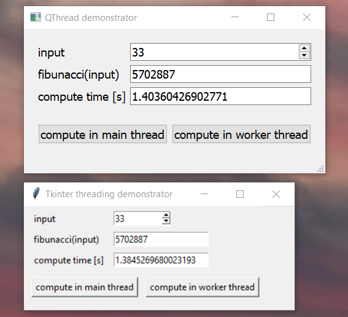

# GUI demonstration with threads
A GUI should be created with a worker-thread and inter-thread communication for demonstration purpose. Two solution have been implemented:

folder    | GUI framework | thread           | inter-thread communication
----------|---------------|------------------|---------------------------
1_Qt      | Qt5           | QThread          | pyqtSignal
2_Tkinter | Tkinter       | threading.Thread | callback function

